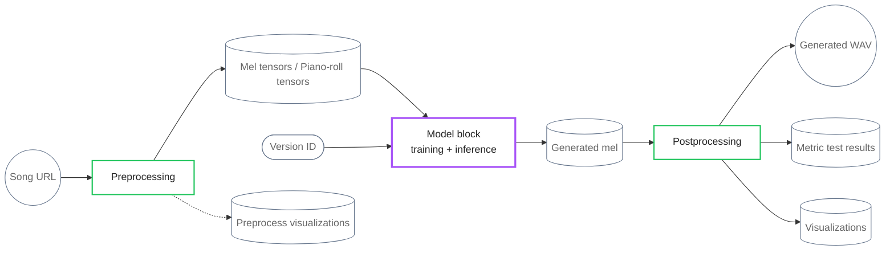
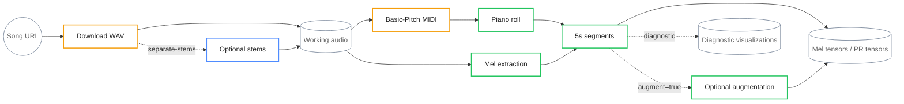
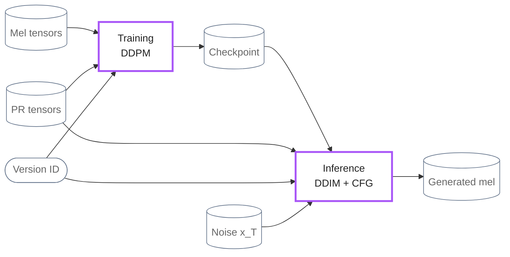
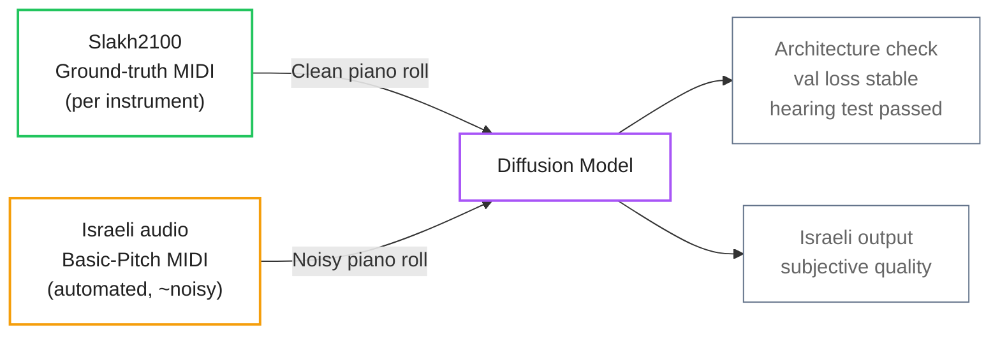
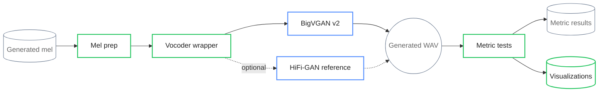
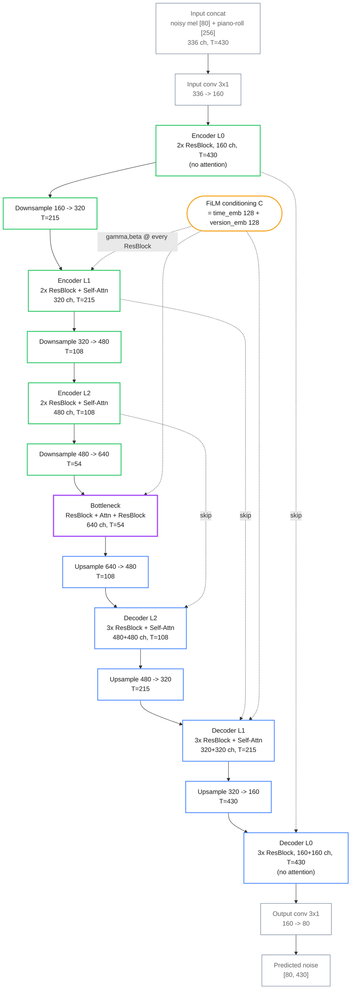
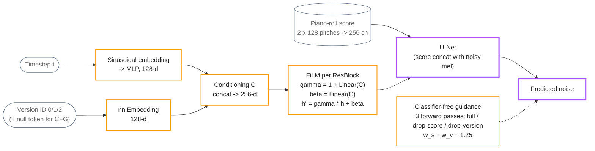

# Diagram sources — snapshot BEFORE advisor-fix round (2026-07-19)

These are the Mermaid sources exactly as they were in `build_showcase.py`
before the advisor-requested changes (remove Demucs branch, split model
training/inference, rename Slakh, expand abbreviations, single vocoder).
The rendered PNG/SVG exports in this folder match these sources.

## 00_pipeline_macro (DIAGRAM_MACRO)

## 01_preprocessing (DIAGRAM_PREPROCESS)

## 02_model (DIAGRAM_MODEL)

## 02_clean_vs_noisy (DIAGRAM_CLEAN_NOISY)

## 03_postprocessing (DIAGRAM_POSTPROCESS)

## 02_unet_architecture (DIAGRAM_UNET) — unchanged in this round

## 02_conditioning (DIAGRAM_CONDITIONING) — abbreviation cleanup only

